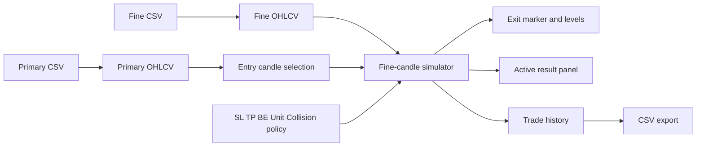

# Trade Analytics UI Layout

Approval wireframe for the trade analytics upgrade.

## Desktop wireframe

```text
+--------------------------------------------------------------------------------+
| Trade Analytics | Data: ready | Pair: CRUDEOIL M15 + M1 | Reset              |
+--------------------------------------------------------------------------------+
| PRIMARY CSV [..................... v]  FINE CSV [..................... v]      |
| UNIT [USD | INR | PIPS]  SAME-CANDLE [Worst case | Best case]                 |
| SL [0.20]   TP [0.40]   BE [off] [trigger ...] [offset ...]   [Apply setup]   |
+---------------------------------------------------------------+----------------+
|                                                               | ACTIVE TRADE   |
|                                                               |                |
|                  STANDARD CANDLES                             | Entry          |
|                  (primary timeframe)                          | 03-08-2026     |
|                                                               | 04:30 M15      |
|                                                               | Side [BUY SELL]|
|                                                               |                |
|                                                               | SL 81.01       |
|                  HEIKIN ASHI                                  | TP 81.61       |
|                  (synchronized view)                          | BE disabled    |
|                                                               |                |
|                                                               | Status         |
|                                                               | Select entry   |
+---------------------------------------------------------------+----------------+
| RESULTS: 12 trades | Last: SL | Exit 04:38 | Duration 8m | [Export CSV]        |
+--------------------------------------------------------------------------------+
| Trade history: Date Time | Symbol | TF | Side | Result | Exit | RR | BE | ...  |
+--------------------------------------------------------------------------------+
```

## Placement rationale

- The setup bar spans the full width because file pairing and risk configuration apply to the whole workspace.
- The charts remain the visual center and retain the existing synchronized standard/Heikin Ashi relationship.
- The right panel is dedicated to the active trade, so entry state and simulation outcome remain visible while inspecting the chart.
- Results sit below the chart for scanning and export without competing with candle selection.

## Mobile wireframe

```text
+--------------------------------+
| Trade Analytics          Reset |
+--------------------------------+
| PRIMARY CSV [................] |
| FINE CSV    [................] |
| [USD] [INR] [PIPS]             |
| SL [....] TP [....] BE [off]   |
| Collision [Worst] [Best]       |
+--------------------------------+
| [Standard] [Heikin Ashi]       |
|                                |
|          CHART                 |
|                                |
+--------------------------------+
| ACTIVE TRADE                   |
| Entry 04:30 | BUY | Pending   |
| SL 81.01 | TP 81.61 | BE off   |
| [BUY] [SELL] [Reset entry]     |
+--------------------------------+
| Last result: SL | Exit 04:38   |
| [Export CSV]                   |
+--------------------------------+
| Trade history                  |
+--------------------------------+
```

## Interaction states

### Initial

- Primary and fine selectors are visible.
- SL/TP inputs are available; BE controls are disabled until toggled on.
- BUY/SELL remains disabled until an entry candle is selected.
- The chart can be navigated normally.

### Entry selected

- The selected primary candle gets an ENTRY marker and a vertical highlight.
- The active trade panel shows timestamp and entry price.
- BUY/SELL becomes available.
- Changing either CSV or core setup resets the pending simulation to avoid stale results.

### Simulation complete

- The chart keeps the entry marker, adds an EXIT marker on the resolved fine candle, and shows SL/TP/BE levels.
- The active trade panel shows result, exit time, duration, MFE, MAE, MaxRR, and BE activation.
- The result is appended to history and export count increments.

### Validation/error

- Missing pair, incompatible asset, malformed CSV, or invalid risk values produces an inline message in the setup bar.
- The chart remains available when configuration is invalid.
- The simulator does not run until all required values are valid.

## Proposed component boundaries

- `DataPairSelector`: primary/fine file selection and pair validation.
- `RiskSetupPanel`: SL, TP, BE, unit, and collision policy.
- `ActiveTradePanel`: entry state, side actions, result summary, and reset.
- `TradeResultsTable`: saved simulations and export action.
- `simulationEngine.ts`: pure fine-candle backtest logic.
- `tradeRecorder.ts`: target schema mapping and CSV export.

These names are proposals, not a requirement to preserve the current component structure.

## Data flow



## Visual direction

- Keep the existing dark chart canvas and compact operational density.
- Use clear status colors: green for favorable/BUY, red for adverse/SELL or SL, amber for BE/pending, and neutral blue for selection/configuration.
- Keep controls rectangular and information-dense; avoid large decorative cards that reduce chart area.
- Use icon buttons only for compact actions such as reset, fit, and export, with tooltips; use text for BUY/SELL and configuration labels.
